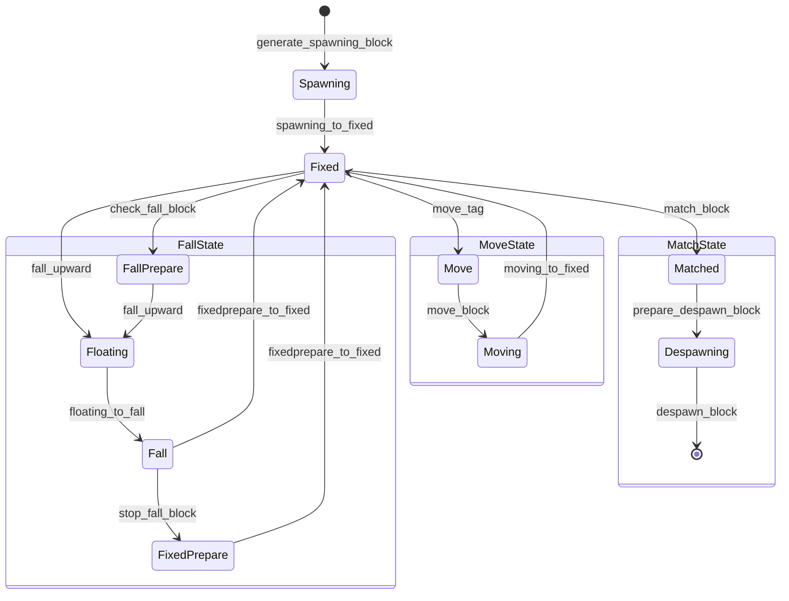

# PanePow
Panel De Pon Clone by Bevy Engine.

## Run

```
cargo run --features native
```

## Block Status


```mermaid
stateDiagram-v2
    [*] --> Spawning: generate_spawning_block
    Spawning --> Fixed: spawning_to_fixed
    Fixed --> FallPrepare: check_fall_block
    Fixed --> Floating: fall_upward
    State FallState {
        FallPrepare --> Floating: fall_upward
        Floating --> Fall: floating_to_fall
        Fall --> FixedPrepare: stop_fall_block
    }
    Fall --> Fixed: fixedprepare_to_fixed
    FixedPrepare --> Fixed: fixedprepare_to_fixed
    Fixed --> Move: move_tag
    State MoveState {
        Move --> Moving: move_block
    }
    Moving --> Fixed: moving_to_fixed
    Fixed --> Matched: match_block
    State MatchState {
        Matched --> Despawning: prepare_despawn_block
        Despawning --> [*]: despawn_block
    }
```